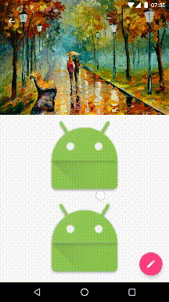

# OverscrollViewBehavior
自定义Behavior实现AppBarLayout越界弹性效果，下拉放大头部View

# Preview

1.获取越界时需要改变尺寸的View 

布局时会调用onLayoutChild()，所以在该方法中可获取需要改变尺寸的View，可以使用View的findViewWithTag方法获取指定的View，并初始化属性。 

Java代码  收藏代码
public class AppBarLayoutOverScrollViewBehavior extends AppBarLayout.Behavior {  
    private static final String TAG = "overScroll";  
    private View mTargetView;       // 目标View  
    private int mParentHeight;      // AppBarLayout的初始高度  
    private int mTargetViewHeight;  // 目标View的高度  
  
    @Override  
    public boolean onLayoutChild(CoordinatorLayout parent, AppBarLayout abl, int layoutDirection) {  
        boolean handled = super.onLayoutChild(parent, abl, layoutDirection);  
        // 需要在调用过super.onLayoutChild()方法之后获取  
        if (mTargetView == null) {  
            mTargetView = parent.findViewWithTag(TAG);  
            if (mTargetView != null) {  
                initial(abl);  
            }  
        }  
        return handled;  
    }  
  
    private void initial(AppBarLayout abl) {  
        // 必须设置ClipChildren为false，这样目标View在放大时才能超出布局的范围  
        abl.setClipChildren(false);  
        mParentHeight = abl.getHeight();  
        mTargetViewHeight = mTargetView.getHeight();  
    }  
  
    ...  
  
}  

需要在布局文件或代码中给目标View指定tag，如下： 

Java代码  收藏代码
<android.support.design.widget.CoordinatorLayout xmlns:android="http://schemas.android.com/apk/res/android"  
    xmlns:app="http://schemas.android.com/apk/res-auto"  
    xmlns:tools="http://schemas.android.com/tools"  
    android:layout_width="match_parent"  
    android:layout_height="match_parent"  
    android:fitsSystemWindows="true">  
  
    <android.support.design.widget.AppBarLayout  
        android:id="@+id/appbar"  
        android:layout_width="match_parent"  
        android:layout_height="wrap_content"  
        android:fitsSystemWindows="true"  
        android:theme="@style/AppTheme.AppBarOverlay"  
        android:transitionName="picture"  
        app:layout_behavior="com.zly.exifviewer.widget.behavior.AppBarLayoutOverScrollViewBehavior"  
        tools:targetApi="lollipop">  
  
        <android.support.design.widget.CollapsingToolbarLayout  
            android:id="@+id/collapsingToolbarLayout"  
            android:layout_width="match_parent"  
            android:layout_height="wrap_content"  
            app:contentScrim="@color/colorPrimary"  
            app:layout_scrollFlags="scroll|enterAlways|enterAlwaysCollapsed"  
            app:statusBarScrim="@color/colorPrimaryDark">  
  
            <ImageView  
                android:id="@+id/siv_picture"  
                android:layout_width="match_parent"  
                android:layout_height="200dp"  
                android:fitsSystemWindows="true"  
                android:foreground="@drawable/shape_fg_picture"  
                android:scaleType="centerCrop"  
                android:tag="overScroll"  
                app:layout_collapseMode="parallax"  
                tools:src="@android:drawable/sym_def_app_icon" />  
  
            <android.support.v7.widget.Toolbar  
                android:id="@+id/toolbar"  
                android:layout_width="match_parent"  
                android:layout_height="?attr/actionBarSize"  
                app:contentInsetEnd="64dp"  
                app:layout_collapseMode="pin"  
                app:popupTheme="@style/AppTheme.PopupOverlay" />  
        </android.support.design.widget.CollapsingToolbarLayout>  
    </android.support.design.widget.AppBarLayout>  
  
    <android.support.v4.widget.NestedScrollView  
        android:layout_width="match_parent"  
        android:layout_height="wrap_content"  
        app:layout_behavior="@string/appbar_scrolling_view_behavior">  
  
        ...  
  
    </android.support.v4.widget.NestedScrollView>  
  
</android.support.design.widget.CoordinatorLayout>  

2.下滑处理 

重写onNestedPreScroll()修改AppBarLayou滑动的顶部后的行为 

Java代码  收藏代码
private static final float TARGET_HEIGHT = 500; // 最大滑动距离  
private float mTotalDy;     // 总滑动的像素数  
private float mLastScale;   // 最终放大比例  
private int mLastBottom;    // AppBarLayout的最终Bottom值  
  
@Override  
public void onNestedPreScroll(CoordinatorLayout coordinatorLayout, AppBarLayout child, View target, int dx, int dy, int[] consumed) {  
    // 1.mTargetView不为null  
    // 2.是向下滑动，dy<0表示向下滑动  
    // 3.AppBarLayout已经完全展开，child.getBottom() >= mParentHeight  
    if (mTargetView != null && dy < 0 && child.getBottom() >= mParentHeight) {  
        // 累加垂直方向上滑动的像素数  
        mTotalDy += -dy;  
        // 不能大于最大滑动距离  
        mTotalDy = Math.min(mTotalDy, TARGET_HEIGHT);  
        // 计算目标View缩放比例，不能小于1  
        mLastScale = Math.max(1f, 1f + mTotalDy / TARGET_HEIGHT);  
        // 缩放目标View  
        ViewCompat.setScaleX(mTargetView, mLastScale);  
        ViewCompat.setScaleY(mTargetView, mLastScale);  
        // 计算目标View放大后增加的高度  
        mLastBottom = mParentHeight + (int) (mTargetViewHeight / 2 * (mLastScale - 1));  
        // 修改AppBarLayout的高度  
        child.setBottom(mLastBottom);  
    } else {  
        super.onNestedPreScroll(coordinatorLayout, child, target, dx, dy, consumed);  
    }  
}  

此时可以实现下滑越界时目标View放大，AppBarLayout变高的效果。 

3.上滑处理 

下滑时目标View放大，AppBarLayout变高，如果此时用户不松开手指，直接上滑，需要目标View缩小，并且AppBarLayout变高。 

默认情况下AppBarLayout的滑动是通过修改top和bottom实现的，所以上滑时，AppBarLayout为整体向上移动，高度不会发生改变，并且AppBarLayout下面的ScrollView也会向上滚动；而我们需要的是在AppBarLayout的高度大于原始高度时，减小AppBarLayout的高度，top不发生改变，并且AppBarLayout下面的ScrollView不会向上滚动。 

AppBarLayout上滑时不会调用onNestedScroll()，所以只能在onNestedPreScroll()方法中修改，这也是为什么选择onNestedPreScroll()方法的原因 

Java代码  收藏代码
@Override  
public void onNestedPreScroll(CoordinatorLayout coordinatorLayout, AppBarLayout child, View target, int dx, int dy, int[] consumed) {  
    if (mTargetView != null && dy < 0 && child.getBottom() >= mParentHeight) {  
        ...  
    } else   
    // 1.mTargetView不为null  
    // 2.是向上滑动，dy>0表示向下滑动  
    // 3.AppBarLayout尚未恢复到原始高度child.getBottom() > mParentHeight  
    if (mTargetView != null && dy > 0 && child.getBottom() > mParentHeight) {  
        // 累减垂直方向上滑动的像素数  
        mTotalDy -= dy;  
        // 计算目标View缩放比例，不能小于1  
        mLastScale = Math.max(1f, 1f + mTotalDy / TARGET_HEIGHT);  
        // 缩放目标View  
        ViewCompat.setScaleX(mTargetView, mLastScale);  
        ViewCompat.setScaleY(mTargetView, mLastScale);  
        // 计算目标View缩小后减少的高度  
        mLastBottom = mParentHeight + (int) (mTargetViewHeight / 2 * (mLastScale - 1));  
        // 修改AppBarLayout的高度  
        child.setBottom(mLastBottom);  
        // 保持target不滑动  
        target.setScrollY(0);  
    } else {  
        super.onNestedPreScroll(coordinatorLayout, child, target, dx, dy, consumed);  
    }  
}  

与上滑的逻辑基本一直，所以可写为一个方法 

Java代码  收藏代码
@Override  
public void onNestedPreScroll(CoordinatorLayout coordinatorLayout, AppBarLayout child, View target, int dx, int dy, int[] consumed) {  
    if (mTargetView != null && ((dy < 0 && child.getBottom() >= mParentHeight) || (dy > 0 && child.getBottom() > mParentHeight))) {  
        scale(child, target, dy);  
    } else {  
        super.onNestedPreScroll(coordinatorLayout, child, target, dx, dy, consumed);  
    }  
}  
  
private void scale(AppBarLayout abl, View target, int dy) {  
    mTotalDy += -dy;  
    mTotalDy = Math.min(mTotalDy, TARGET_HEIGHT);  
    mLastScale = Math.max(1f, 1f + mTotalDy / TARGET_HEIGHT);  
    ViewCompat.setScaleX(mTargetView, mLastScale);  
    ViewCompat.setScaleY(mTargetView, mLastScale);  
    mLastBottom = mParentHeight + (int) (mTargetViewHeight / 2 * (mLastScale - 1));  
    abl.setBottom(mLastBottom);  
    target.setScrollY(0);  
}  

4.还原 

当AppBarLayout处于越界时，如果用户松开手指，此时应该让目标View和AppBarLayout都还原到原始状态，重写onStopNestedScroll()方法 

Java代码  收藏代码
@Override  
public void onStopNestedScroll(CoordinatorLayout coordinatorLayout, AppBarLayout abl, View target) {  
    recovery(abl);  
    super.onStopNestedScroll(coordinatorLayout, abl, target);  
}  
  
private void recovery(final AppBarLayout abl) {  
    if (mTotalDy > 0) {  
        mTotalDy = 0;  
        // 使用属性动画还原  
        ValueAnimator anim = ValueAnimator.ofFloat(mLastScale, 1f).setDuration(200);  
        anim.addUpdateListener(new ValueAnimator.AnimatorUpdateListener() {  
            @Override  
            public void onAnimationUpdate(ValueAnimator animation) {  
                float value = (float) animation.getAnimatedValue();  
                ViewCompat.setScaleX(mTargetView, value);  
                ViewCompat.setScaleY(mTargetView, value);  
                abl.setBottom((int) (mLastBottom - (mLastBottom - mParentHeight) * animation.getAnimatedFraction()));  
            }  
        });  
        anim.start();  
    }  
}  

5.优化 

由于用户在滑动时有可能触发快速滑动，会导致在AppBarLayout收起后触发还原动画，重新修改AppBarLayout的Bottom，从而显示错误，所以当发生快速滑动时需要禁止还原动画，直接还原到初始状态 

Java代码  收藏代码
private boolean isAnimate;  //是否有动画  
  
@Override  
public boolean onStartNestedScroll(CoordinatorLayout parent, AppBarLayout child, View directTargetChild, View target, int nestedScrollAxes) {  
    // 开始滑动时，启用动画  
    isAnimate = true;  
    return super.onStartNestedScroll(parent, child, directTargetChild, target, nestedScrollAxes);  
}  
  
@Override  
public boolean onNestedPreFling(CoordinatorLayout coordinatorLayout, AppBarLayout child, View target, float velocityX, float velocityY) {  
    // 如果触发了快速滚动且垂直方向上速度大于100，则禁用动画  
    if (velocityY > 100) {  
        isAnimate = false;  
    }  
    return super.onNestedPreFling(coordinatorLayout, child, target, velocityX, velocityY);  
}  
  
private void recovery(final AppBarLayout abl) {  
    if (mTotalDy > 0) {  
        mTotalDy = 0;  
        if (isAnimate) {  
            ValueAnimator anim = ValueAnimator.ofFloat(mLastScale, 1f).setDuration(200);  
            anim.addUpdateListener(new ValueAnimator.AnimatorUpdateListener() {  
                @Override  
                public void onAnimationUpdate(ValueAnimator animation) {  
                    float value = (float) animation.getAnimatedValue();  
                    ViewCompat.setScaleX(mTargetView, value);  
                    ViewCompat.setScaleY(mTargetView, value);  
                    abl.setBottom((int) (mLastBottom - (mLastBottom - mParentHeight) * animation.getAnimatedFraction()));  
                }  
            });  
            anim.start();  
        } else {  
            ViewCompat.setScaleX(mTargetView, 1f);  
            ViewCompat.setScaleY(mTargetView, 1f);  
            abl.setBottom(mParentHeight);  
        }  
    }  
}  
